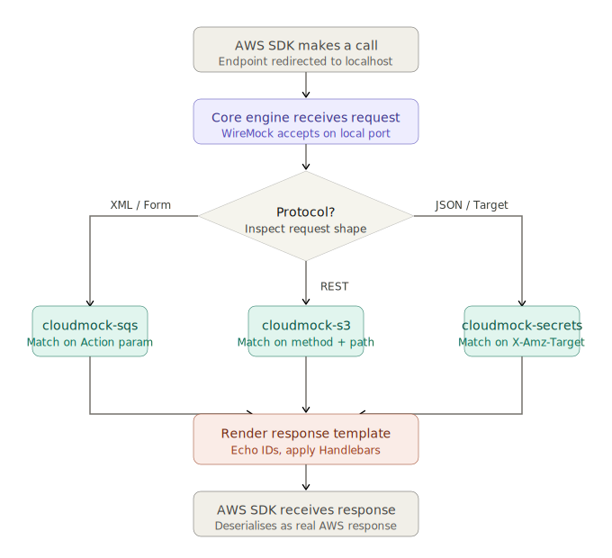

# CloudMock

> An ultra-lightweight, containerless AWS mock framework for the JVM.

CloudMock lets you test AWS service integrations locally without Docker, without credentials, and without waiting for a
container to spin up. It runs entirely in memory inside the JVM, starts in milliseconds, and loads only the service
modules your project actually needs.

---

## Why CloudMock

Local AWS testing today means running LocalStack — a full Docker container backed by a Python runtime. It works, but it
brings real costs: 15–60 seconds of startup on every CI run, a hard Docker dependency that breaks lightweight runners,
an online license check for the Pro tier, and every service module loaded into memory whether you use it or not.

CloudMock is the answer to a simple question: what if the mock ran inside the JVM itself?

No container. No external process. No configuration. Tests that touch AWS services start at the same speed as tests that
don't.

---

## Core design principles

**Zero container overhead.** The entire mock runs in-process. There is nothing to pull, nothing to start, and nothing to
tear down outside the JVM.

**Total dependency isolation.** Each AWS service is a separate, optional module. If you don't declare it as a
dependency, its code never touches your classpath. A project that only uses SQS pays nothing for S3, DynamoDB, or
anything else.

**Encapsulated engine.** WireMock powers the networking layer under the hood, but it is completely hidden. Developers
interact only with CloudMock's own APIs and never touch WireMock directly.

**Zero configuration.** No accounts, no tokens, no internet connection required. Drop the dependency in, write your
test, and run it.

---

## How it works

The **core engine** boots the server, injects `aws.endpoint-url` to redirect the AWS SDK, and discovers modules via
`ServiceLoader`. Each **service module** registers its protocol stubs against the core. An embedded **WireMock driver**
handles all networking and Handlebars response templating — fully hidden from the developer.

---

## Request routing

Each module implements whichever of the three AWS protocol families its service uses.

| Protocol            | Services              | Matched on                  |
|---------------------|-----------------------|-----------------------------|
| XML / Form URL      | SQS, SNS              | `Action` form parameter     |
| JSON / X-Amz-Target | Secrets Manager, DynamoDB | `X-Amz-Target` header   |
| REST path           | S3                    | HTTP method + URL path      |

---

## Module ecosystem

Modules follow a plug-and-play model. Declare only what you need.

| Module                     | Protocol             | Status            |
|----------------------------|----------------------|-------------------|
| `cloudmock-sqs`            | XML / Form URL       | Planned — Phase 2 |
| `cloudmock-secretsmanager` | JSON / Target Header | Planned — Phase 2 |
| `cloudmock-s3`             | REST path            | Planned — Phase 3 |
| `cloudmock-dynamodb`       | JSON / Target Header | Planned — Phase 3 |
| `cloudmock-lambda`         | JSON / Target Header | Planned — Phase 3 |

`cloudmock-sqs` and `cloudmock-secretsmanager` are the two foundational modules. They are built first specifically
because they represent opposite protocol families, making them the canonical reference for all future module authors.

---

## Agentic AI layer

CloudMock's clean module contract makes it a natural platform for AI-assisted tooling. Four capabilities are planned:

- **Stub generation agent** — takes a Smithy or OpenAPI model and generates a complete module automatically.
- **Interaction capture agent** — records live AWS SDK traffic and synthesises stubs from it.
- **Test assertion agent** — inspects the interaction log after a test run and surfaces correctness gaps.
- **Fault scenario generator** — produces a fault-injection test matrix from a service topology description.

---

## Implementation plan

**Phase 1 — Foundation:** Gradle monorepo, SPI contract (`CloudMockService` + `StubRegistrar`) frozen, core engine
(WireMock bootstrap, SDK redirect, `ServiceLoader` discovery), smoke test.

**Phase 2 — Reference modules:** `cloudmock-sqs` (XML/Form standard) and `cloudmock-secretsmanager`
(JSON/Target standard) — canonical reference implementations for all future module authors.

**Phase 3 — Developer experience:** JUnit 5 `@ExtendWith` extension, fault injection API, stub generation agent,
public documentation site.

---

## Scope and limitations

CloudMock simulates the AWS API surface well enough to test application logic, but it is not a full reimplementation of
AWS. The following are explicitly out of scope:

- AWS SDK v1 — automatic endpoint redirection via `aws.endpoint-url` is v2-only; SDK v1 users can opt into the `cloudmock-sdk-v1` companion library (Phase 2) for a one-line client setup helper
- SQS FIFO deduplication and ordering semantics
- S3 multipart upload lifecycle and versioning
- DynamoDB conditional expressions and transaction semantics
- IAM policy evaluation

Tests that depend on these behaviours should use LocalStack or a real AWS environment. CloudMock is the right tool for
testing that your application correctly calls AWS, not for testing how AWS itself behaves.

---

## Comparison with alternatives

|                   | CloudMock | LocalStack (free) | LocalStack (Pro) | Mockito / SDK mocks |
|-------------------|-----------|-------------------|------------------|---------------------|
| Startup time      | ~100ms    | 15–60s            | 15–60s           | Instant             |
| Docker required   | No        | Yes               | Yes              | No                  |
| Internet required | No        | No                | Yes (license)    | No                  |
| Tests HTTP layer  | Yes       | Yes               | Yes              | No                  |
| Modular footprint | Yes       | No                | No               | N/A                 |
| Open source       | Yes       | Partial           | No               | Yes                 |

---

## Contributing

CloudMock is designed to grow through community-contributed modules. Once the module contract is published at the end of
Phase 1, any team can build and distribute a module for any AWS service without modifying the core.

The module authoring guide (published in Phase 3) will walk through building a module from scratch, including how to
choose the right protocol family, how to structure response templates, and how to write tests that validate correct SDK
integration.
